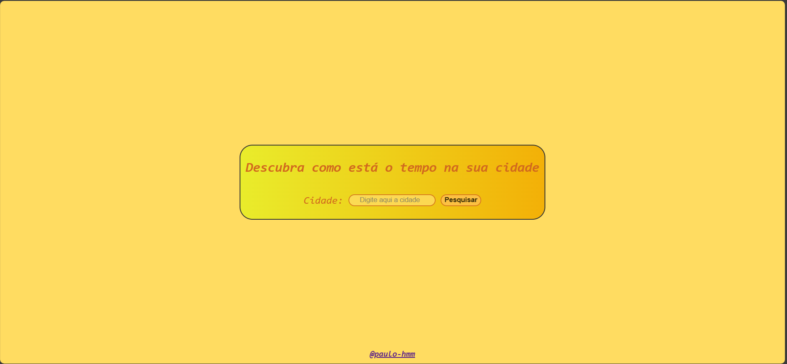
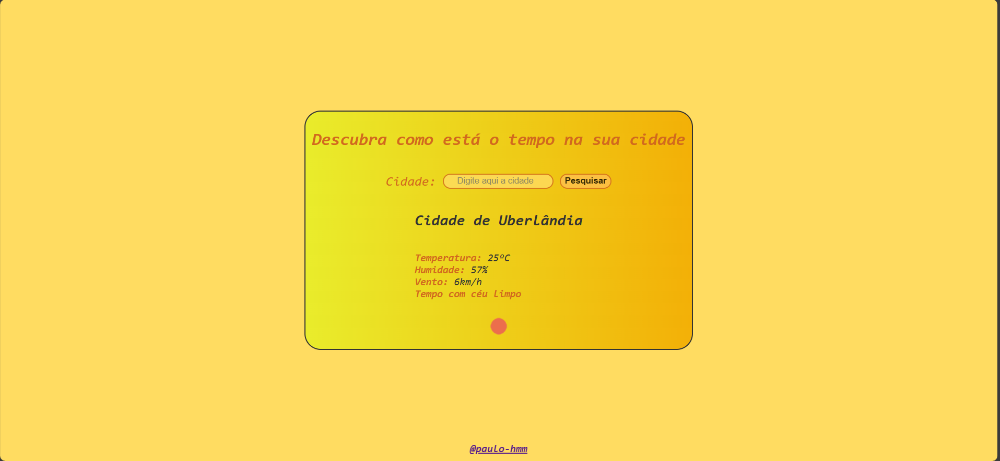

# API Capstone Project

Este é um projeto simples que utiliza uma API de previsão do tempo para mostrar informações sobre o clima em uma cidade específica.

## Tecnologias Utilizadas

- Node.js
- Express.js
- EJS (Embedded JavaScript templates)
- Axios (para fazer requisições HTTP)

## Instalação

1. Clone o repositório:

   ```bash
   git clone https://github.com/paulo-hmm/weather_consult.git


Claro! Aqui está um exemplo de um README para o seu projeto:

markdown
Copy code
# API Capstone Project

Este é um projeto simples que utiliza uma API de previsão do tempo para mostrar informações sobre o clima em uma cidade específica.

## Tecnologias Utilizadas

- Node.js
- Express.js
- EJS (Embedded JavaScript templates)
- Axios (para fazer requisições HTTP)

## Instalação

1. Clone o repositório:

   ```bash
   git clone https://github.com/paulo-hmm/weather_consult.git

2. Navegue até o diretório do projeto:

    ```bash
    cd weather_consult

3. Instale as dependências:

    ```bash
    npm install

4. Execute o servidor:

    ```bash
    npm start

5. Abra o navegador e acesse http://localhost:3000.

## Funcionalidades

- **Descubra como está o tempo na sua cidade:** Digite o nome da cidade no campo de entrada e clique em "GET".
- **Visualize informações detalhadas:** Receba informações úteis sobre o clima, como temperatura, umidade, descrição do tempo e velocidade do vento.



## Estrutura do Projeto

- **`views`:** Contém os arquivos de visualização EJS.
- **`public`:** Pasta para arquivos estáticos, como folhas de estilo CSS.

## Autor

- Paulo Henrique Marques Martins (@paulo-hmm)